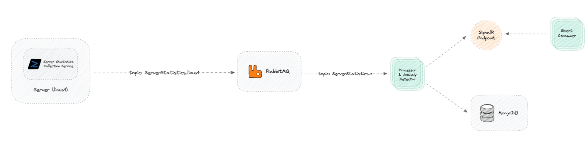

# Server Monitoring and Notification System 🕵🏼 🚨

## **Task 1: Server Statistics Collection Service**

- **Objective:** Develop a C# process that collects and publishes server statistics, specifically memory usage, available memory, and CPU usage.
- **Requirements:**
    - Collect server statistics (memory usage, available memory, and CPU usage) at regular intervals, specified by a configurable period `SamplingIntervalSeconds`, using the `System.Diagnostics` namespace.
    - Encapsulate the collected statistics (memory usage, available memory, CPU usage, and timestamp) into a statistics object.
    - Publish the statistics object to a message queue under the topic `ServerStatistics.<ServerIdentifier>`, where `<ServerIdentifier>` is a configurable option.
    - Implement an abstraction for message queuing to ensure the code is not tightly coupled to RabbitMQ.

## **Task 2: Message Processing and Anomaly Detection Service**

- **Objective:** Develop a C# process that receives server statistics from the message queue, persists the data to a MongoDB instance, and sends alerts if anomalies or high usage is detected.
- **Requirements:**
    - Receive messages from the message queue with the topic `ServerStatistics.*` and deserialize them into objects containing memory usage, available memory, CPU usage, server's identifier, and timestamp.
    - Persist the deserialized data to a MongoDB instance.
    - Implement anomaly detection logic based on configurable threshold percentages specified in `appsettings.json`.
    - Send an "Anomaly Alert" via SignalR if a sudden increase (anomaly) in memory usage or CPU usage is detected.
    - Send a "High Usage Alert" via SignalR if the calculated memory usage percentage or CPU usage exceeds the specified "Usage Threshold".
    - Implement abstractions for MongoDB and message queuing to ensure the code is not tightly coupled to specific implementations.
 
## **Task 3: SignalR Event Consumer Service**

- **Objective:** Develop a C# process that connects to a SignalR hub and prints received events to the console.
- **Requirements:**
    - Establish a connection to a SignalR hub.
    - Subscribe to events and print them to the console as they are received.
 

## **Optional Tasks:**

### **Optional Task 4: Create a Reusable RabbitMQ Client Library**

- **Objective:** Develop a reusable class library for interacting with RabbitMQ, thereby abstracting the RabbitMQ client and making it easier to switch to a different message queuing system in the future.
- **Requirements:**
    - Implement a class for publishing messages to a RabbitMQ exchange.
    - Implement a class for consuming messages from a RabbitMQ queue.
    - Both classes should utilize an interface, making the library extensible and not tightly coupled to RabbitMQ.
 

## **How to Run?**

To run this simple app, you need to run an instance of each service sequentially as follows:
SignalRServer -> SignalREventConsumer -> ServerStatisticsCollection -> MessageProcessing

If any issue occur try to run MessageProcessing before ServerStatisticsCollection

## **System Pipeline**

